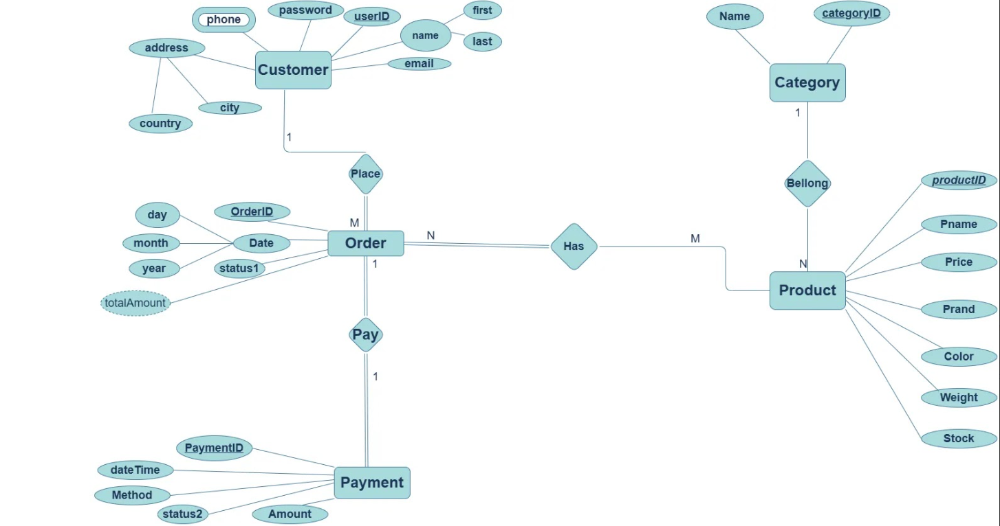

# Ecommerce Platform 

## Project Description
E-commerce Platform: Handle product listings, customer accounts, orders, payments, and shipping details.

<br />

## Table of Contents

* [Getting Started](#getting-started)
* [ER Diagram](./ERD.png)
* [Rational Schema](Mapping.jpg)
* [Schema](#schema)

## Getting Started

1- Clone the repository
```bash
git clone https://github.com/sallamnasr/Ecommerce-Platform-.git
```

2- Run the application
```bash
dotnet run
```


## ER Diagram


## Schema
```sql
create database Ecommerce ;
use Ecommerce; 
CREATE TABLE Customer (
    userID INT IDENTITY(1,1) PRIMARY KEY,
    first NVARCHAR(50),
    last NVARCHAR(50),
    name NVARCHAR(100),
    email NVARCHAR(100),
    password NVARCHAR(100),
    phone NVARCHAR(15),
    address NVARCHAR(255),
    city NVARCHAR(50),
    country NVARCHAR(50)
);

CREATE TABLE Category (
    categoryID INT IDENTITY(1,1) PRIMARY KEY,
    Name NVARCHAR(50)
);

CREATE TABLE Product (
    productID INT IDENTITY(1,1) PRIMARY KEY,
    Pname NVARCHAR(100),
    Price DECIMAL(10, 2),
    Prand NVARCHAR(50),
    Color NVARCHAR(20),
    Weight DECIMAL(10, 2),
    Stock INT,
    categoryID INT FOREIGN KEY REFERENCES Category(categoryID)
);

CREATE TABLE [Order] (
    OrderID INT IDENTITY(1,1) PRIMARY KEY,
    userID INT FOREIGN KEY REFERENCES Customer(userID),
    Date DATE,
    status1 NVARCHAR(50),
    totalAmount DECIMAL(10, 2)
);

CREATE TABLE Payment (
    PaymentID INT IDENTITY(1,1) PRIMARY KEY,
    OrderID INT FOREIGN KEY REFERENCES [Order](OrderID),
    dateTime DATETIME,
    Method NVARCHAR(50),
    status2 NVARCHAR(50),
    Amount DECIMAL(10, 2)
);

CREATE TABLE OrderProduct (
    OrderID INT FOREIGN KEY REFERENCES [Order](OrderID),
    productID INT FOREIGN KEY REFERENCES Product(productID),
    PRIMARY KEY (OrderID, productID)
);

```

## Seed Data
```sql

-- Customer
INSERT INTO Customer (first, last, name, email, password, phone, address, city, country) VALUES 
('John', 'Doe', 'John Doe', 'john.doe@example.com', 'password123', '1234567890', '123 Elm Street', 'New York', 'USA'),
('Jane', 'Smith', 'Jane Smith', 'jane.smith@example.com', 'password456', '0987654321', '456 Oak Avenue', 'Los Angeles', 'USA');

-- Category
INSERT INTO Category (Name) VALUES 
('Electronics'),
('Clothing'),
('Groceries');

-- Product
INSERT INTO Product (Pname, Price, Prand, Color, Weight, Stock, categoryID) VALUES 
('Smartphone', 699.99, 'BrandA', 'Black', 0.2, 50, 1),
('Laptop', 999.99, 'BrandB', 'Silver', 1.5, 30, 1),
('Jeans', 49.99, 'BrandC', 'Blue', 1.0, 100, 2),
('Milk', 1.99, 'BrandD', 'White', 1.0, 200, 3);

-- Order
INSERT INTO [Order] (userID, Date, status1, totalAmount) VALUES 
(1, '2024-12-20', 'Pending', 750.98),
(2, '2024-12-21', 'Completed', 51.98);

-- Payment
INSERT INTO Payment (OrderID, dateTime, Method, status2, Amount) VALUES 
(1, '2024-12-20 10:30:00', 'Credit Card', 'Processed', 750.98),
(2, '2024-12-21 12:00:00', 'PayPal', 'Processed', 51.98);

-- OrderProduct
INSERT INTO OrderProduct (OrderID, productID) VALUES 
(1, 1), -- Order 1 contains Smartphone
(1, 3), -- Order 1 contains Jeans
(2, 4); -- Order 2 contains Milk

```

